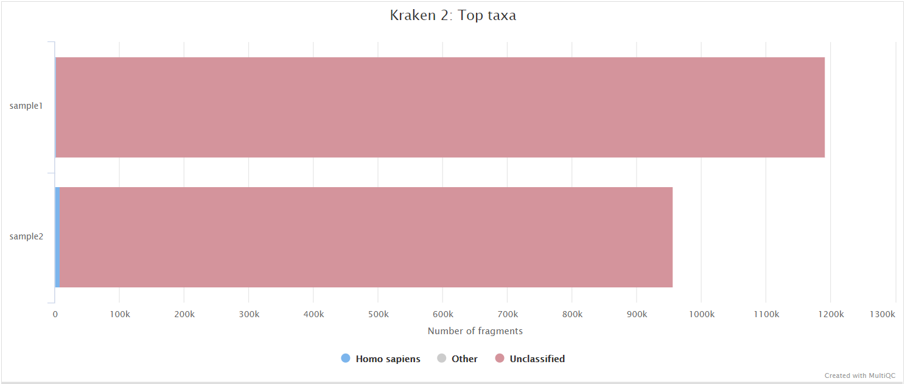
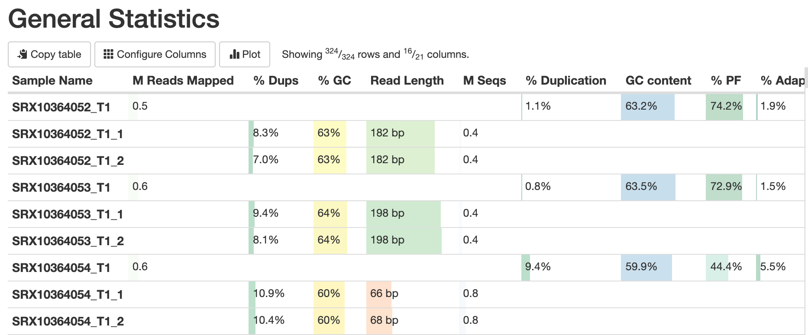

# avantonder/bacQC: Output

## Introduction

This document describes the output produced by the pipeline. Most of the plots are taken from the MultiQC report, which summarises results at the end of the pipeline.

The directories listed below will be created in the results directory after the pipeline has finished. All paths are relative to the top-level results directory.

## Pipeline overview

The pipeline is built using [Nextflow](https://www.nextflow.io/)
and processes data using the following steps:

- [`FastQC`](#fastqc)
- [`Fastq summary statistics`](#fastq-summary-statistics)
- [`Read trimming`](#read-trimming)
- [`Assign taxonomy to reads`](#assign-taxonomy-to-reads)
- [`Re-estimate taxonomy`](#re-estimate-taxonomy)
- [`Extract reads`](#extract-reads)
- [`Species composition`](#calculate-species-composition)
- [`Sequencing statistics`](#sequencing-statistics)
- [`MultiQC`](#multiqc) 
- [`Pipeline information`](#pipeline-information)

### FastQC

Output files

- `fastqc/`
  - `*_fastqc.html`: FastQC report containing quality metrics.
  - `*_fastqc.zip`: Zip archive containing the FastQC report, tab-delimited data file and plot images.

[FastQC](http://www.bioinformatics.babraham.ac.uk/projects/fastqc/) gives general quality metrics about your sequenced reads. It provides information about the quality score distribution across your reads, per base sequence content (%A/T/G/C), adapter contamination and overrepresented sequences. For further reading and documentation see the [FastQC help pages](http://www.bioinformatics.babraham.ac.uk/projects/fastqc/Help/).

> **NB:** The FastQC plots displayed in the MultiQC report shows _untrimmed_ reads. They may contain adapter sequence and potentially regions with low quality.

### Fastq summary statistics

Output files

- `fastqscan/`
  - `raw/*.json`: JSON formatted file of summary statistics for input fastq files.
  - `trimmed/*.json`: JSON formatted file of summary statistics for trimmed fastq files.
- `metadata/`
  - `raw_fastq-scan_summary.tsv`: Final summary tsv file of sequencing statistics for input fastq files for all samples
  - `trim_fastq-scan_summary.tsv`: Final summary tsv file of sequencing statistics for trimmed fastq files for all samples

[fastq-scan](https://github.com/rpetit3/fastq-scan) is a tool for generating FASTQ summary statistics in JSON format.

### Read Trimming

Output files

* `fastp/`
    * `*.html` html reports of the trimming process that can be opened in any modern web browser. See [here](http://opengene.org/fastp/fastp.html) for an example
    * `*.json` trimming report metrics in JSON computer readable formats. See [here](http://opengene.org/fastp/fastp.json) for an example
    * `trimmed/*.trim.fastq.gz` trimmed/modified/unmerged fastq reads

[fastp](https://github.com/OpenGene/fastp) is a tool used to perform adapter/quality trimming on sequencing reads.

### Assign taxonomy to reads

Output files

* `kraken2/`
    * `*.kraken2.report.txt`: Kraken 2 taxonomic report. See [here](https://ccb.jhu.edu/software/kraken2/index.shtml?t=manual#sample-report-output-format) for a detailed description of the format.

[Kraken 2](https://ccb.jhu.edu/software/kraken2/index.shtml?t=manual) is a sequence classifier that assigns taxonomic labels to DNA sequences. Kraken 2 examines the k-mers within a query sequence and uses the information within those k-mers to query a database. That database maps k-mers to the lowest common ancestor (LCA) of all genomes known to contain a given k-mer.

### Re-estimate taxonomy

Output files

* `bracken/`
    * `*_S.tsv`: Bracken TSV output report of the re-estimated abundances. See [here](https://ccb.jhu.edu/software/bracken/index.shtml?t=manual) for a detailed description of the format.

[Bracken](https://ccb.jhu.edu/software/bracken/) (Bayesian Reestimation of Abundance with KrakEN) is a highly accurate statistical method that computes the abundance of species in DNA sequences from a metagenomics sample.

### Extract reads

Output files

- `extracted_reads/`
  - `*.extracted.fastq.gz`: reads extracted using the provided taxon ID

[KrakenTools](https://github.com/jenniferlu717/KrakenTools) is a suite of scripts to be used for post-analysis of Kraken/KrakenUniq/Kraken2/Bracken results.

### Calculate species composition

Output files

- `metadata/`
  - `species_composition.tsv`: Final summary tsv file of species composition for all samples.

[kraken_parser.py](https://github.com/avantonder/bacQC/blob/main/bin/kraken_parser.py) is a script used to summarise the results of Kraken 2 and Bracken for all samples.

## Sequencing statistics

Output files

- `read_stats/`
  - `.tsv`: Pre- and post-trimming sequence statistics.
- `metadata`
  - `read_stats_summary.tsv`: Final summary tsv file of pre- and post-trimming sequence statistics for all samples.

### MultiQC

Output files

- `multiqc/`
  - `multiqc_report.html`: a standalone HTML file that can be viewed in your web browser.
  - `multiqc_data/`: directory containing parsed statistics from the different tools used in the pipeline.
  - `multiqc_plots/`: directory containing static images from the report in various formats.

[MultiQC](http://multiqc.info) is a visualization tool that generates a single HTML report summarising all samples in your project. Most of the pipeline QC results are visualised in the report and further statistics are available in the report data directory.

Results generated by MultiQC collate pipeline QC from supported tools e.g. FastQC. The pipeline has special steps which also allow the software versions to be reported in the MultiQC output for future traceability. For more information about how to use MultiQC reports, see <http://multiqc.info>.

### Pipeline information

Output files

- `pipeline_info/`
  - Reports generated by Nextflow: `execution_report.html`, `execution_timeline.html`, `execution_trace.txt` and `pipeline_dag.dot`/`pipeline_dag.svg`.
  - Reports generated by the pipeline: `pipeline_report.html`, `pipeline_report.txt` and `software_versions.yml`. The `pipeline_report*` files will only be present if the `--email` / `--email_on_fail` parameter's are used when running the pipeline.
  - Reformatted samplesheet files used as input to the pipeline: `samplesheet.valid.csv`.

[Nextflow](https://www.nextflow.io/docs/latest/tracing.html) provides excellent functionality for generating various reports relevant to the running and execution of the pipeline. This will allow you to troubleshoot errors with the running of the pipeline, and also provide you with other information such as launch commands, run times and resource usage.
